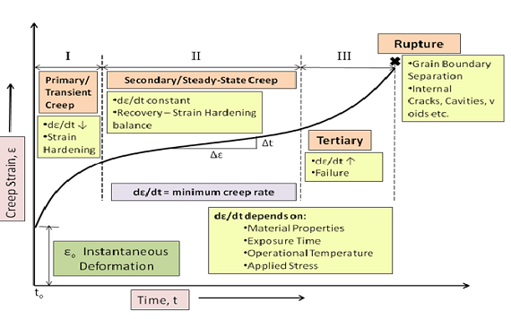
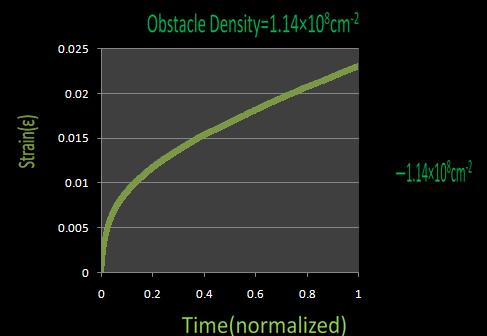
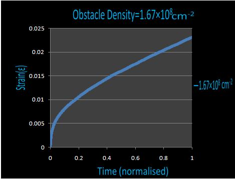
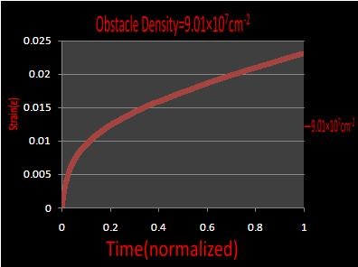
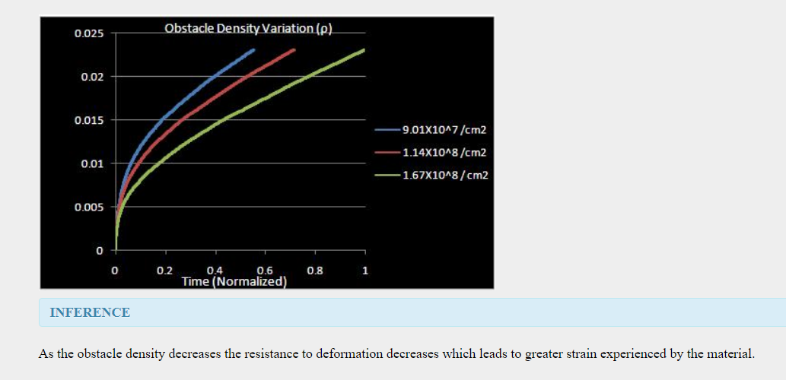

Creep is progressive i.e. permanent and time dependant deformation of a material at a constant stress below the yield strength of the material. Creep is seen in all types of materials and is observed to be severe in materials that are utilized in applications involving high operating temperatures for long periods of time. The deformation caused by creep need not always be catastrophic i.e. if a component is deformed by creep beyond the tolerable limits of the application, the application as a whole may fail even though the component has not actually fractured. Also it is not always an undesirable property, e.g. concrete has inbuilt tensile stresses which may lead to its fracture however, due to some moderate creep these stresses get relieved and the structure is saved. It is important to note that the words "permanent" and "time dependant" are very important since the deformation is not an elastic one nor is it a brittle one.The strain keeps on building over a period of time. Creep though dependant on various factors is generally observed to increase with rise in temperature.It is particularly important for metals whose operating temperature is greater than 0.4Tm and even amorphous polymers are sensitive to creep   

 
<video width="500" height="240" controls>
  <source src="images/cmf.mp4" type="video/mp4">
  Your browser does not support the video tag</video>
 
  

  Obstacle is something which impedes or hinders the motion of another object. Rivers, cliffs and ridges are examples of natural obstacles which we try to overcome by building bridges i.e. go over the obstacle or we circumvent the obstacle by going on a track around it or we simply blast off the obstacle (mountain, huge rock) etc. and go through a tunnel. When we consider microstructures we deal with dislocations whose motion could be impeded by precipitates, dispersoids, grain boundaries or other dislocations as well. Obstacle could be a force generated due to some reaction at some totally different location. These obstacles might be present due to erroneous manufacturing process or they could be made available artificially for improvement of certain properties. Dislocations may go around, overor through to overcome the obstacles. The obstacle size, distribution, orientation, density, strength and inter-obstacle distance are important parameters to be considered. It is observed that higher the obstacle density, higher is the number of obstacles encountered and since energy is required to overcome an obstacle higher the number of obstacles more is the energy required. Hence creep deformation is less since dislocations travel a relatively small distance at the expense of greater energy.  
  <b>Results</b>  
   
   
   
  <b>Conclusion</b>  
   
